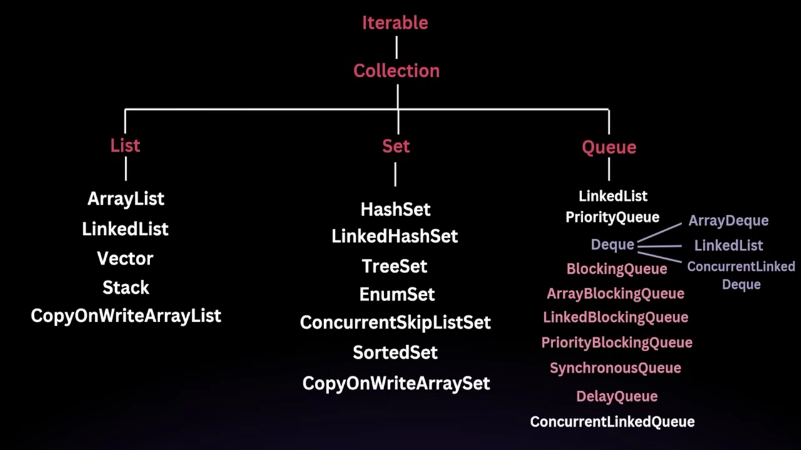

# 🌟 Java Collection Framework

## 🎯 What is a Collection Framework?
The **Java Collection Framework** provides a set of interfaces and classes that help in managing groups of objects. 
-Before **JDK 1.2**, Java relied on various classes like `Vector`, `Stack`, `Hashtable`, and `Arrays` to store and manipulate groups of objects. However, these had several drawbacks:

❌ **Inconsistency**: Each class had a different way of managing collections, leading to confusion and a steep learning curve.

❌ **Lack of Interoperability**: These classes were not designed to work together seamlessly.

❌ **No Common Interface**: There was no unified interface, making it difficult to write generic algorithms that could operate on different types of collections.

### 🚀 Introduction of the Collection Framework
To solve these problems, the **Collection Framework** was introduced in **JDK 1.2** with the following benefits:

✅ **Unified Architecture**: A consistent set of interfaces for all collections.

✅ **Interoperability**: Collections can be easily interchanged and manipulated in a uniform way.

✅ **Reusability**: Generic algorithms can be written to work with any collection.

✅ **Efficiency**: Provides efficient algorithms for basic operations like searching, sorting, and manipulation.

## 🔑 Key Interfaces in the Collection Framework
The Collection Framework is primarily built around a set of interfaces. The most important ones are:

- 📌 **Collection**: The root interface for all other collection types.

- 📋 **List**: An ordered collection that can contain duplicate elements *(e.g., `ArrayList`, `LinkedList`)*.

- 🔳 **Set**: A collection that does not allow duplicate elements *(e.g., `HashSet`, `TreeSet`)*.
- 🔄 **Queue**: A collection designed for holding elements prior to processing *(e.g., `PriorityQueue`, `LinkedList` when used as a queue)*.

- 🔃 **Deque**: A double-ended queue that allows insertion and removal from both ends *(e.g., `ArrayDeque`)*.

- 🔑 **Map**: Represents a collection of key-value pairs *(e.g., `HashMap`, `TreeMap`)*.

## 📂 Collection Hierarchy
The **Collection Framework** is organized into a hierarchy where the core interfaces are at the top, and the specific implementations extend these interfaces.

---

This is an introduction to the **Java Collection Framework**. More details on individual collections will be covered in the theory sections. 🚀
